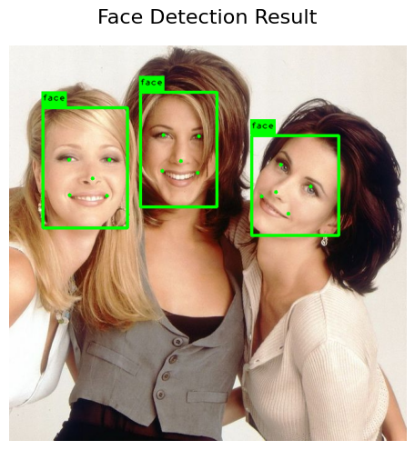
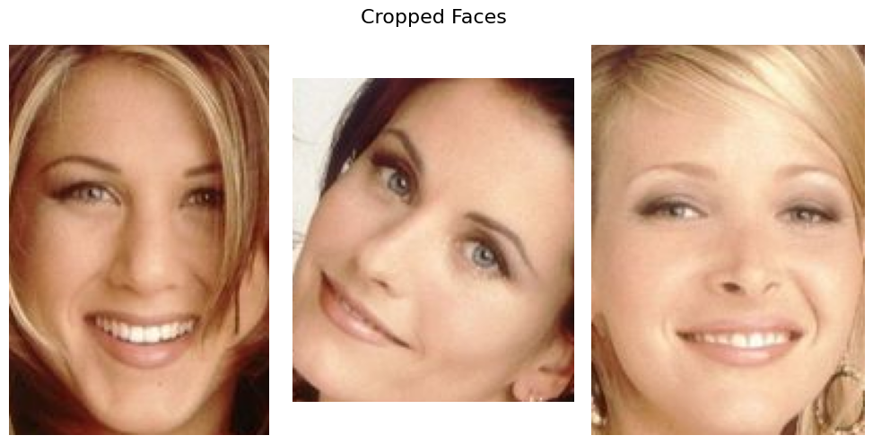
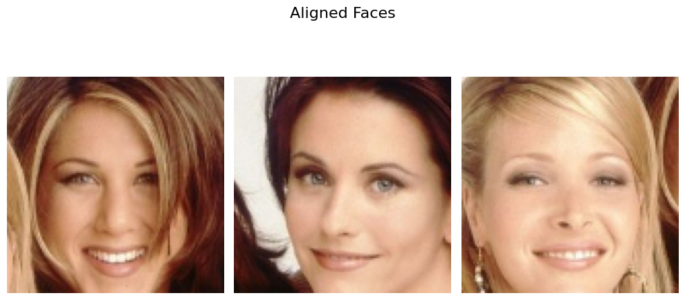
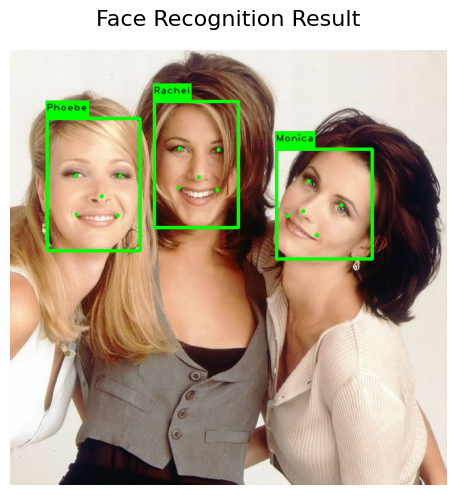

# A Comprehensive Guide to Building a Face Recognition System

Face recognition is a cutting-edge application of computer vision that enables systems to identify or verify individuals based on their facial features. This guide takes you through the process of building a robust face recognition pipeline, covering key components such as face detection, alignment, embedding extraction, and database matching. 

The examples and code provided in this guide are available in our [hailo_examples](https://github.com/degirum/hailo_examples) repository. Users are encouraged to clone the repository and follow the setup instructions to prepare their hardware. The repository also includes sample images used in the code examples, allowing for hands-on practice and experimentation.

By following this guide, you will gain practical knowledge and insights into implementing face recognition systems capable of handling real-world challenges like varying lighting, poses, and expressions.


## Introduction to Face Recognition Systems

Face recognition is a transformative application of computer vision that enables systems to identify or verify individuals based on their facial features. These systems operate through a pipeline of well-defined steps: detecting faces, aligning them for consistency, extracting unique facial features (embeddings), and comparing these features against a database of known individuals. This structured approach ensures accuracy, robustness, and scalability.

Modern face recognition systems rely heavily on deep learning models to perform these tasks. The pipeline begins with **face detection**, where specialized models identify faces and their key landmarks. These landmarks are used to align faces, ensuring that variations in pose, orientation, or size do not affect subsequent steps. The aligned faces are then passed through **embedding models**, which generate high-dimensional vectors representing unique facial features. Finally, these embeddings are compared using similarity metrics such as **cosine similarity** to identify or verify individuals.

This guide explores each stage of the pipeline, introduces commonly used models, and highlights the importance of critical steps like alignment and embedding extraction. By the end, you will understand how these components work together to build robust face recognition systems capable of handling real-world challenges such as variations in lighting, pose, and expression.

---

## Stages in a Face Recognition Pipeline

A face recognition system operates through a sequence of well-defined stages, each essential for ensuring accurate and reliable results:

1. **Face Detection and Keypoint Extraction**: The process begins with detecting faces in an image or video using specialized models. These models not only identify the bounding boxes of faces but also detect key facial landmarks, such as the eyes, nose, and mouth. These landmarks are crucial for ensuring accurate alignment in the next step.
   
   Several face detection models are widely used in modern pipelines:
   - **SCRFD**: A lightweight and efficient model optimized for speed and accuracy, ideal for resource-constrained environments.
   - **RetinaFace**: Known for its high accuracy, RetinaFace detects five key landmarks along with bounding boxes, making it a popular choice for robust alignment.
   - **YOLOv8-based Models**: Adapted for face detection tasks, these models provide state-of-the-art performance with keypoint detection capabilities.

   These models handle variations in lighting, pose, and scale, ensuring reliable detection even in challenging conditions.

2. **Face Alignment**: Detected faces are standardized in orientation and size using the extracted keypoints. This process involves rotating, scaling, and cropping faces to ensure that features like the eyes and mouth are consistently positioned. Alignment reduces variations caused by pose or tilt, making the inputs more consistent for subsequent steps. By aligning faces, the system ensures that the embedding model focuses on relevant features, improving the quality and reliability of the embeddings.

3. **Embedding Extraction**: Once aligned, the faces are passed through an embedding model, such as **ArcFace-MobileFaceNet**, which generates a high-dimensional feature vector (e.g., 512 dimensions) representing each face. These embeddings encode the unique characteristics of the face, enabling efficient comparison.

4. **Database Matching**: The generated embeddings are compared against a database of known embeddings using similarity metrics such as cosine similarity. If the similarity exceeds a predefined threshold, the system identifies or verifies the individual.

---

## Stage 1: Face Detection with Keypoint Detection

Face detection is the first step in a face recognition pipeline, and using models that detect key facial landmarks ensures accurate alignment for subsequent steps. Below is an example of using the **SCRFD model** with the DeGirum PySDK to perform face detection and extract keypoints. 

The code demonstrates how to load a face detection model, run inference on an image, and obtain both bounding boxes and keypoints. We will use the below image for illustrative purposes.


```python
import degirum as dg
import degirum_tools

# Specify the model name 
face_det_model_name = "scrfd_10g--640x640_quant_hailort_hailo8l_1"
# face_det_model_name = "scrfd_2.5g--640x640_quant_hailort_hailo8l_1"
# face_det_model_name = "scrfd_500m--640x640_quant_hailort_hailo8l_1"
# face_det_model_name = "yolov8n_relu6_widerface_kpts--640x640_quant_hailort_hailo8l_1"
# face_det_model_name = "retinaface_mobilenet--736x1280_quant_hailort_hailo8l_1"

# Specify the inference host address
inference_host_address = "@cloud"  # Use "@cloud" for cloud inference
# inference_host_address = "@local"  # Use "@local" for local inference

# Specify the zoo_url
zoo_url = "degirum/models_hailort"
# zoo_url = "<path to local folder>"  # For local model files

# Specify the image source
image_source = "../assets/Friends1.jpg"

# Set the token for accessing the inference service
token = degirum_tools.get_token()
# token = ''  # Leave empty for local inference

# Load the face detection model
face_det_model = dg.load_model(
    model_name=face_det_model_name,
    inference_host_address=inference_host_address,
    zoo_url=zoo_url,
    token=token, 
    overlay_color=(0, 255, 0)  # Green color for bounding boxes
)

# Run the inference
detected_faces = face_det_model(image_source)
print(detected_faces)

```


### Explanation of the Code

1. **Model Selection**: You can choose different SCRFD model variants depending on your requirements (e.g., accuracy vs. speed). Options include:
   - `scrfd_10g`: High accuracy, suitable for detailed analysis.
   - `scrfd_2.5g` and `scrfd_500m`: Faster models, optimized for edge devices.
   - `yolov8n`: YOLOv8 version
   - `retinaFace_mobilenet`

2. **Inference Host Address**: The system can run on a cloud service (`@cloud`) or locally (`@local`), depending on the setup.

3. **Zoo URL**: Specifies the location of the model zoo. Use the cloud-based zoo (`degirum/models_hailort`) or point to a local directory for offline inference. If you use cloud-based zoo, the model is automatically downloaded if not present on the device.

4. **Image Source**: Input image on which the model will perform inference.

5. **Model Loading**: The `dg.load_model` function initializes the chosen model using the specified parameters.

6. **Running Inference**: The model processes the input image and outputs detection results, including bounding boxes and keypoints.

7. **Results**: The output includes:
   - `bbox`: The coordinates of the bounding boxes around detected faces.
   - `landmarks`: Key facial landmarks such as the eyes, nose, and mouth, useful for face alignment.


We can visualize the detected faces and landmarks by overlaying the results onto the original image. DeGirum PySDK provides a convenient method `inference_results.image_overlay` where `inference_results` are the results returned by the model. Additonally, `inference_results.image` contains the original image and can be used to crop bounding boxes. We define a utility function to help visualize the results in a jupyter notebook environment.

```python
import matplotlib.pyplot as plt
def display_images(images, title="Images", figsize=(15, 5)):
    """
    Display a list of images in a single row using Matplotlib.

    Parameters:
    - images (list): List of images (NumPy arrays) to display.
    - title (str): Title for the plot.
    - figsize (tuple): Size of the figure.
    """
    num_images = len(images)
    fig, axes = plt.subplots(1, num_images, figsize=figsize)
    if num_images == 1:
        axes = [axes]  # Make it iterable for a single image
    for ax, image in zip(axes, images):
        image_rgb = image[:, :, ::-1]  # Convert BGR to RGB
        ax.imshow(image_rgb)
        ax.axis('off')
    fig.suptitle(title, fontsize=16)
    plt.tight_layout()
    plt.show()
```

Using the above function, we can visualize the results of the face detection model.

```python
display_images([detected_faces.image_overlay], title="Face Detection Result")
```
The output looks as below:



We can also crop the individual faces using the bounding box information.

```python
# Lists to store cropped and aligned faces
cropped_faces = []

# Process each detection result
for face in detected_faces.results:
    # Extract bounding box (assumed in [x1, y1, x2, y2] format)
    x1, y1, x2, y2 = map(int, face["bbox"])  # Convert bbox coordinates to integers
    cropped_face = detected_faces.image[y1:y2, x1:x2]  # Crop the face from the image
    cropped_faces.append(cropped_face)

# Display cropped faces
display_images(cropped_faces, title="Cropped Faces", figsize=(10, 5))
```
The output looks as below:



---
## Stage 2: Alignment

The first two steps—face detection and alignment—are foundational to the success of a face recognition pipeline. Detection models like **RetinaFace** and **SCRFD** provide both bounding boxes and keypoints, which are essential for accurate alignment. Without alignment, variations in pose, orientation, and scale could lead to inconsistent embeddings, reducing the system's reliability. Proper alignment ensures that the embedding model focuses on the same facial features across different images, improving accuracy even in challenging scenarios like surveillance or multi-angle datasets.

The code below uses the detected landmarks to align the image and provide a cropped version that can be used as an input to a face recognition model.

```python
import numpy as np
import cv2

def align_and_crop(img, landmarks, image_size=112):
    """
    Align and crop the face from the image based on the given landmarks.

    Args:
        img (np.ndarray): The full image (not the cropped bounding box). This image will be transformed.
        landmarks (List[np.ndarray]): List of 5 keypoints (landmarks) as (x, y) coordinates. These keypoints typically include the eyes, nose, and mouth.
        image_size (int, optional): The size to which the image should be resized. Defaults to 112. It is typically either 112 or 128 for face recognition models.

    Returns:
        Tuple[np.ndarray, np.ndarray]: The aligned face image and the transformation matrix.
    """
    # Define the reference keypoints used in ArcFace model, based on a typical facial landmark set.
    _arcface_ref_kps = np.array(
        [
            [38.2946, 51.6963],  # Left eye
            [73.5318, 51.5014],  # Right eye
            [56.0252, 71.7366],  # Nose
            [41.5493, 92.3655],  # Left mouth corner
            [70.7299, 92.2041],  # Right mouth corner
        ],
        dtype=np.float32,
    )

    # Ensure the input landmarks have exactly 5 points (as expected for face alignment)
    assert len(landmarks) == 5

    # Validate that image_size is divisible by either 112 or 128 (common image sizes for face recognition models)
    assert image_size % 112 == 0 or image_size % 128 == 0

    # Adjust the scaling factor (ratio) based on the desired image size (112 or 128)
    if image_size % 112 == 0:
        ratio = float(image_size) / 112.0
        diff_x = 0  # No horizontal shift for 112 scaling
    else:
        ratio = float(image_size) / 128.0
        diff_x = 8.0 * ratio  # Horizontal shift for 128 scaling

    # Apply the scaling and shifting to the reference keypoints
    dst = _arcface_ref_kps * ratio
    dst[:, 0] += diff_x  # Apply the horizontal shift

    # Estimate the similarity transformation matrix to align the landmarks with the reference keypoints
    M, inliers = cv2.estimateAffinePartial2D(np.array(landmarks), dst, ransacReprojThreshold=1000)
    assert np.all(inliers == True)
    
    # Apply the affine transformation to the input image to align the face
    aligned_img = cv2.warpAffine(img, M, (image_size, image_size), borderValue=0.0)

    return aligned_img, M
```

We can now visualize the aligned and cropped faces using the code below:

```python
# Lists to store aligned faces
aligned_faces = []

# Process each detection result
for face in detected_faces.results:
    # Extract landmarks and align the face
    landmarks = [landmark["landmark"] for landmark in face["landmarks"]]
    aligned_face, _ = align_and_crop(detected_faces.image, landmarks)  # Align and crop face
    aligned_faces.append(aligned_face)

# Display aligned faces
display_images(aligned_faces, title="Aligned Faces", figsize=(10, 5))   
```
The resulting image looks as below:



---

## Stage 3: Extracting Embeddings

We can now use a face recognition model to extract the embeddings from the aligned faces using the code below:

```python
# Face recognition model name
face_rec_model_name = "arcface_mobilefacenet--112x112_quant_hailort_hailo8l_1"

# Load the face recognition model
face_rec_model = dg.load_model(
    model_name=face_rec_model_name,
    inference_host_address=inference_host_address,
    zoo_url=zoo_url,
    token=token
)

# Process each detected face
for face in detected_faces.results:
    # Extract landmarks and align the face
    landmarks = [landmark["landmark"] for landmark in face["landmarks"]]
    aligned_face, _ = align_and_crop(detected_faces.image, landmarks)  # Align and crop face
    face_embedding = face_rec_model(aligned_face).results[0]["data"][0]

```
---
## Stage 4: Database Matching
The last step in the face recognition pipeline is to search for the nearest face in a database of known faces and assign an identity. For this, we need to first build a database of known faces. Each entry in the database, should contain an embedding and an identity. For robustness, we can have multiple database entries for the same person. In such a scenario, multiple entries will have the same identity value. We will use `lancedb`, a popular vector database package for storing and querying embeddings. We first define the database schema which simply consists of a unique id, an embedding, and an entity_name (identity).

```python
from lancedb.pydantic import LanceModel, Vector
import uuid
import numpy as np
from typing import List, Dict

class FaceRecognitionSchema(LanceModel):
    id: str  # Unique identifier for each entry
    vector: Vector(512)  # Face embeddings, fixed size of 512
    entity_name: str  # Name of the entity

    @classmethod
    def prepare_face_records(cls, face_embeddings: List[Dict], entity_name: str) -> List['FaceRecognitionSchema']:
        """
        Converts a list of face detection results to a list of FaceRecognitionSchema instances.

        Args:
            face_embeddings (List[Dict]): List of face embeddings.
            entity_name (str): Name of the entity.

        Returns:
            List[FaceRecognitionSchema]: List of formatted instances.
        """
        if not face_embeddings:
            return []

        formatted_records = []
        for embedding in face_embeddings:
            formatted_records.append(
                cls(
                    id=str(uuid.uuid4()),  # Generate a unique ID
                    vector=np.array(embedding, dtype=np.float32),  # Convert embedding to float32 numpy array
                    entity_name=entity_name
                )
            )
        return formatted_records
```

To build a database, we need a folder of images of the people we want to recognize. As pointed out earlier, it is preferable to have multiple images for a single person to improve the robustness. Let us say, we need a system to recognize 3 people: Alice, Bob,  and Charlie. In this case, the folder should contain images named: Alice_1, Alice_2, Bob_1, Bob_2, Bob_3, Charlie_1, Charlie_2 etc. Below is a function that iterates over all the images in the folder, find the face in each image, extracts the embeddings of the face, and stores the embedding along with the identity in the database. In order to maintain the quality of the database, any image that contains more than one face is skipped. 

```python
from pathlib import Path
import logging
from typing import Any

# Configure logging for better output control
logging.basicConfig(level=logging.WARNING, format="%(asctime)s - %(levelname)s - %(message)s")

def populate_database_from_images(
    input_path: str,
    face_det_model: Any,
    face_rec_model: Any,
    tbl: Any  # LanceDB table object
) -> None:
    """
    Iterates over images in a directory, detects faces, generates embeddings,
    and populates the database with face records.

    Args:
        input_path (str): Path to the directory containing image files.
        face_det_model (Any): Face detection and keypoints model.
        face_rec_model (Any): Face re-identification model.
        tbl (Any): LanceDB table object.
    """
    path = Path(input_path)
    num_entities = 0  # Counter for the number of entities added to the database

    # Find all image files and identities in the directory and subdirectories
    image_files = [str(file) for file in path.rglob("*") if file.suffix.lower() in (".png", ".jpg", ".jpeg")]
    identities = [file.stem.split("_")[0] for file in path.rglob("*") if file.suffix.lower() in (".png", ".jpg", ".jpeg")]
    
    if not image_files:
        logging.warning(f"No image files found in {input_path}.")
        return

    for identity, detected_faces in zip(identities, face_det_model.predict_batch(image_files)):
        try:
            # Count number of detected faces
            num_faces = len(detected_faces.results)

            # Skip images with more than one face
            if num_faces > 1:
                logging.warning(f"Skipped {detected_faces.info} as it contains more than one face ({num_faces} faces detected).")
                continue
            elif num_faces == 0:
                logging.warning(f"Skipped {detected_faces.info} as no faces were detected.")
                continue

            # Process the single detected face
            result = detected_faces.results[0]

            # Generate face embedding
            aligned_img, _ = align_and_crop(detected_faces.image, [landmark["landmark"] for landmark in result["landmarks"]])
            face_embedding = face_rec_model(aligned_img).results[0]["data"][0]
            
            # Prepare records for the database
            records = FaceRecognitionSchema.prepare_face_records([face_embedding], identity)

            # Add records to the database if valid
            if records:
                tbl.add(data=records)
                num_entities += len(records)
            else:
                logging.warning(f"No valid records generated for {detected_faces.info}.")

        except Exception as e:
            logging.error(f"Error processing {file}: {e}", exc_info=True)

    # Log summary
    logging.info(f"Successfully added {num_entities} entities to the database table.")
    total_entities = tbl.count_rows()
    logging.info(f"The table now contains {total_entities} entities.")
```

Using the above function and the associated schema, we can now build a database of known faces with the code below.

```python
import lancedb

# Database and table setup
uri = "../.temp/face_database"
table_name = "face"

# Path to the directory containing the sample dataset for indexing.
input_path = "../assets/Friends_dataset"

# Connect to the database
db = lancedb.connect(uri=uri)

# Initialize the table
if table_name not in db.table_names():
    tbl = db.create_table(table_name, schema=FaceRecognitionSchema)
else:
    tbl = db.open_table(table_name)
    schema_fields = [field.name for field in tbl.schema]
    if schema_fields != list(FaceRecognitionSchema.model_fields.keys()):
        raise RuntimeError(f"Table {table_name} has a different schema.")

# Process images and populate the database
populate_database_from_images(
    input_path=input_path,
    face_det_model=face_det_model,
    face_rec_model=face_rec_model,
    tbl=tbl
)
```

We now need a function that takes in a query embedding and returns the identity of the closest embedding in the database. The function should also take a threshold as an argument so that it can return `Unknown` as identity if the similarity metric of the closest embedding is less than the threshold. The code for such a function is provided below:

```python
from typing import List, Any
import numpy as np

def identify_faces(
    embeddings: List[np.ndarray],  # List of NumPy arrays representing face embeddings
    tbl: Any,                      # The database or table object supporting the search method
    field_name: str,               # Name of the vector column in the database
    metric_type: str,              # Metric type for distance calculation (e.g., "cosine", "euclidean")
    top_k: int,                    # Number of top results to fetch from the database
    threshold: float = 0.3         # Distance threshold for assigning labels
) -> List[str]:
    """
    Identifies faces by searching for the nearest embeddings in the database and assigning labels.

    Args:
        embeddings (List[np.ndarray]): List of NumPy arrays representing face embeddings.
        tbl (Any): Database or table object supporting search functionality.
        field_name (str): Name of the vector column to search against.
        metric_type (str): Distance metric to use (e.g., "cosine", "euclidean").
        top_k (int): Number of top results to retrieve.
        threshold (float, optional): Minimum similarity score for assigning a known label. Defaults to 0.3.

    Returns:
        List[str]: List of labels for the provided embeddings. Returns "Unknown" for embeddings below the threshold.
    """
    identities = []  # List to store the assigned labels
    similarity_scores = []  # List to store the similarity scores

    for embedding in embeddings:
        # Perform database search
        search_result = (
            tbl.search(
                embedding,
                vector_column_name=field_name
            )
            .metric(metric_type)
            .limit(top_k)
            .to_list()
        )

        # Check if search_result has any entries
        if not search_result:
            identities.append("Unknown")
            continue

        # Calculate the similarity score
        similarity_score = round(1 - search_result[0]["_distance"], 2)

        # Assign a label based on the similarity threshold
        identity = search_result[0]["entity_name"] if similarity_score >= threshold else "Unknown"

        # Append the label to the results list
        identities.append(identity)
        similarity_scores.append(similarity_score)
    return identities, similarity_scores
```
---
## Putting It All Together
Now, we can put all of the above logic together to build a face recognition pipeline as below:

```python
import lancedb
# database related parameters
top_k = 1
field_name = "vector"
metric_type = "cosine"

# Database and table parameters
uri = "../.temp/face_database"
table_name = "face"

# Connect to the database
db = lancedb.connect(uri=uri)
tbl = db.open_table(table_name)

# check the schema of the table to ensure it matches the expected schema
schema_fields = [field.name for field in tbl.schema]
if schema_fields != list(FaceRecognitionSchema.model_fields.keys()):
    raise RuntimeError(f"Table {table_name} has a different schema.")

# image source
image_source = "../assets/Friends1.jpg"

# run the face detection model
face_det_model.overlay_show_probabilities=False
detected_faces = face_det_model(image_source) 

# Process the detected faces: align, crop, extract embeddings and find the identity
if detected_faces.results:
    for face in detected_faces.results:
        landmarks = [landmark["landmark"] for landmark in face["landmarks"]]
        aligned_face, _ = align_and_crop(detected_faces.image, landmarks)
        face_embedding = face_rec_model(aligned_face).results[0]["data"][0]
        identities, similarity_scores = identify_faces([face_embedding], tbl, field_name, metric_type, top_k)
        # replace the label and score in the result with the identity and similarity score
        face["label"] = identities[0]  # Assign the first label
        face["score"] = similarity_scores[0]  # Assign the first score

display_images([detected_faces.image_overlay], title="Face Recognition Result", figsize=(10, 10)) 
```

The output looks as below:



### Optimizing for Performance

The above code can be optimized for performance by batching the aligned faces into a list and using `predict_batch` method in DeGirum PySDK as illustrated below:

```python
image_source = "../assets/Friends1.jpg"
detected_faces = face_det_model(image_source) 
aligned_faces = []
if detected_faces.results:
    for face in detected_faces.results:
        landmarks = [landmark["landmark"] for landmark in face["landmarks"]]
        aligned_face, _ = align_and_crop(detected_faces.image, landmarks)
        aligned_faces.append(aligned_face)    
    
    # Run batch predict on aligned faces, find identity, assign labels and scores to each detection
    for face, face_embedding in zip(detected_faces.results, face_rec_model.predict_batch(aligned_faces)):
        embedding = face_embedding.results[0]["data"][0]  # Extract embedding
        identities, similarity_scores = identify_faces([embedding], tbl, field_name, metric_type, top_k)
        face["label"] = identities[0]  # Assign the first label
        face["score"] = similarity_scores[0]  # Assign the first score

display_images([detected_faces.image_overlay], title="Face Recognition Result", figsize=(10, 5))  
```

### Running on a Video Stream

The above code can be made to run on a video stream with minor modifications. We use the `predict_stream` function in `degirum_tools` to run the face detection model on a vide stream. The code is illustrated below:

```python
video_source = 1 # can be a web camera index, a video file, URL of an RTSP stream or a you tube video URL

with degirum_tools.Display("AI Camera") as output_display:
    for detected_faces in degirum_tools.predict_stream(face_det_model, video_source):
        if detected_faces.results:
            aligned_faces = []
            for face in detected_faces.results:
                landmarks = [landmark["landmark"] for landmark in face["landmarks"]]
                aligned_face, _ = align_and_crop(detected_faces.image, landmarks)
                aligned_faces.append(aligned_face)    
            
            # Run batch predict on aligned faces, find identity, assign labels and scores to each detection
            for face, face_embedding in zip(detected_faces.results, face_rec_model.predict_batch(aligned_faces)):
                embedding = face_embedding.results[0]["data"][0]  # Extract embedding
                identities, similarity_scores = identify_faces([embedding], tbl, field_name, metric_type, top_k)
                face["label"] = identities[0]  # Assign the first label
                face["score"] = similarity_scores[0]  # Assign the first score
        output_display.show(detected_faces.image_overlay)
```